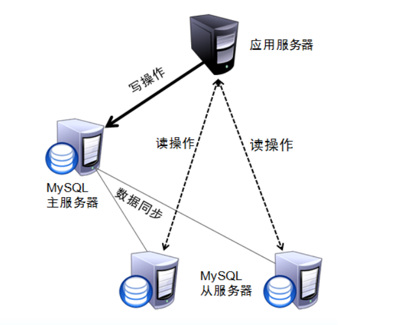
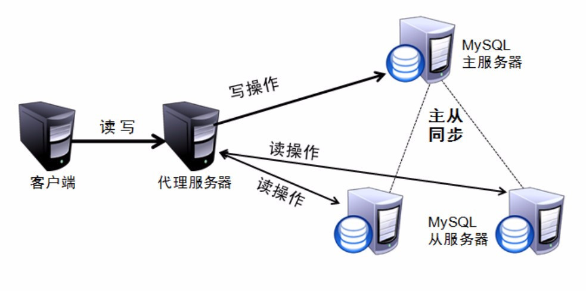

# 日志、缓存、及分布式数据库

> **Organization**: 千锋教育 Python 教学部<br>
> **Date**: 2018-11-24<br>
> **Author**: [张旭](mailto:zhangxu@1000phone.com)


## 一、日志处理

1. 日志的作用
    1. 记录程序运行状态
        1. 线上环境所有程序以 deamon 形式运行在后台, 无法使用 print 输出程序状态
        2. 线上程序无人值守全天候运行, 需要有一种能持续记录程序运行状态的机制, 以便遇到问题后分析处理
    2. 记录统计数据
    3. 开发时进行 Debug (调试)

2. 基本用法

    ```python
    import logging

    # 设置日志格式
    fmt = '%(asctime)s %(levelname)7.7s %(funcName)s: %(message)s'
    formatter = logging.Formatter(fmt, datefmt="%Y-%m-%d %H:%M:%S")

    # 设置 handler
    handler = logging.handlers.TimedRotatingFileHandler('myapp.log', when='D', backupCount=30)
    handler.setFormatter(formatter)

    # 定义 logger 对象
    logger = logging.getLogger("MyApp")
    logger.addHandler(handler)
    logger.setLevel(logging.INFO)
    ```

3. 日志的等级
    * DEBUG: 调试信息
    * INFO: 普通信息
    * WARNING: 警告
    * ERROR: 错误
    * FATAL: 致命错误

4. 对应函数
    * `logger.debug(msg)`
    * `logger.info(msg)`
    * `logger.warning(msg)`
    * `logger.error(msg)`
    * `logger.fatal(msg)`

5. 日志格式允许的字段

    * `%(name)s` : Logger的名字
    * `%(levelno)s` : 数字形式的日志级别
    * `%(levelname)s` : 文本形式的日志级别
    * `%(pathname)s` : 调用日志输出函数的模块的完整路径名, 可能没有
    * `%(filename)s` : 调用日志输出函数的模块的文件名
    * `%(module)s` : 调用日志输出函数的模块名
    * `%(funcName)s` : 调用日志输出函数的函数名
    * `%(lineno)d` : 调用日志输出函数的语句所在的代码行
    * `%(created)f` : 当前时间, 用UNIX标准的表示时间的浮点数表示
    * `%(relativeCreated)d` : 输出日志信息时的, 自Logger创建以来的毫秒数
    * `%(asctime)s` : 字符串形式的当前时间。默认格式是“2003-07-08 16:49:45,896”。逗号后面的是毫秒
    * `%(thread)d` : 线程ID。可能没有
    * `%(threadName)s` : 线程名。可能没有
    * `%(process)d` : 进程ID。可能没有
    * `%(message)s` : 用户输出的消息

6. Django 中的日志配置

    ```python
    LOGGING = {
        'version': 1,
        'disable_existing_loggers': True,
        # 格式配置
        'formatters': {
            'simple': {
                'format': '%(asctime)s %(module)s.%(funcName)s: %(message)s',
                'datefmt': '%Y-%m-%d %H:%M:%S',
            },
            'verbose': {
                'format': ('%(asctime)s %(levelname)s [%(process)d-%(threadName)s] '
                        '%(module)s.%(funcName)s line %(lineno)d: %(message)s'),
                'datefmt': '%Y-%m-%d %H:%M:%S',
            }
        },
        # Handler 配置
        'handlers': {
            'console': {
                'class': 'logging.StreamHandler',
                'level': 'DEBUG' if DEBUG else 'WARNING'
            },
            'info': {
                'class': 'logging.handlers.TimedRotatingFileHandler',
                'filename': f'{BASE_DIR}/logs/info.log',  # 日志保存路径
                'when': 'D',        # 每天切割日志
                'backupCount': 30,  # 日志保留 30 天
                'formatter': 'simple',
                'level': 'INFO',
            },
            'error': {
                'class': 'logging.handlers.TimedRotatingFileHandler',
                'filename': f'{BASE_DIR}/logs/error.log',  # 日志保存路径
                'when': 'W0',      # 每周一切割日志
                'backupCount': 4,  # 日志保留 4 周
                'formatter': 'verbose',
                'level': 'WARNING',
            }
        },
        # Logger 配置
        'loggers': {
            'django': {
                'handlers': ['console'],
            },
            'inf': {
                'handlers': ['info'],
                'propagate': True,
                'level': 'INFO',
            },
            'err': {
                'handlers': ['error'],
                'propagate': True,
                'level': 'WARNING',
            }
        }
    }
    ```


## 二、缓存处理

1. 缓存一般处理流程

    ```python
    data = get_from_cache(key)   # 首先从缓存中获取数据
    if data is None:
        data = get_from_db()     # 缓存中没有, 从数据库获取
        set_to_cache(key, data)  # 将数据添加到缓存, 方便下次获取
    return data
    ```

2. Django 的默认缓存接口

    ```python
    from django.core.cache import cache

    cache.set('a', 123, 10)
    a = cache.get('a')
    print(a)
    x = cache.incr(a)
    print(a)
    ```

3. Django 中使用 Redis 缓存

    - 安装 django_redis: `pip install django_redis`

    - 配置

        ```Python
        # settings 添加如下配置
        CACHES = {
            "default": {
                "BACKEND": "django_redis.cache.RedisCache",
                "LOCATION": "redis://127.0.0.1:6379/1",
                "OPTIONS": {
                    "CLIENT_CLASS": "django_redis.client.DefaultClient",
                    "PICKLE_VERSION": -1,
                }
            }
        }
        ```

4. Redis 回顾

    - **String 类**: 常用作普通缓存

        | CMD     |          Example          | Description |
        |---------|---------------------------|-------------|
        | set     | set('a', 123)             | 设置值 |
        | get     | get('a')                  | 获取值 |
        | incr    | incr('a')                 | 自增 |
        | decr    | decr('a')                 | 自减 |
        | mset    | mset(a=123, b=456, c=789) | 设置多个值 |
        | mget    | mget(['a', 'b', 'c'])     | 获取多个值 |
        | setex   | setex('kk', 21, 10)       | 设置值的时候, 同时设置过期时间 |
        | setnx   | setnx('a', 999)           | 如果不存在, 则设置该值 |

    - **Hash 类**: 常用作对象存储

        | CMD     |          Example                  | Description |
        |---------|-----------------------------------|-------------|
        | hset    | hset('obj', 'name', 'hello')      | 在哈希表 obj 中添加一个 name = hello 的值 |
        | hget    | hget('obj', 'name')               | 获取哈希表 obj 中的值 |
        | hmset   | hmset('obj', {'a': 1, 'b': 3})    | 在哈希表中设置多个值 |
        | hmget   | hmget('obj', ['a', 'b', 'name'])  | 获取多个哈希表中的值 |
        | hgetall | hgetall('obj')                    | 获取多个哈希表中所有的值 |
        | hincrby | hincrby('obj', 'count')           | 将哈希表中的某个值自增 1 |
        | hdecrby | hdecrby('obj', 'count')           | 将哈希表中的某个值自减 1 |

    - **List 类**: 常用作队列(消息队列、任务队列等)

        | CMD     |          Example        | Description      |
        |---------|-------------------------|------------------|
        | lpush   | lpush(name, *values)    | 向列表左侧添加多个元素 |
        | rpush   | rpush(name, *values)    | 向列表右侧添加多个元素 |
        | lpop    | lpop(name)              | 从列表左侧弹出一个元素 |
        | rpop    | rpop(name)              | 从列表右侧弹出一个元素 |
        | blpop   | blpop(keys, timeout=0)  | 从列表左侧弹出一个元素, 列表为空时阻塞 timeout 秒 |
        | brpop   | brpop(keys, timeout=0)  | 从列表右侧弹出一个元素, 列表为空时阻塞 timeout 秒 |
        | llen    | llen(name)              | 获取列表长度 |
        | ltrim   | ltrim(name, start, end) | 从 start 到 end 位置截断列表 |

    - **Set 类**: 常用作去重

        | CMD       |          Example       | Description   |
        |-----------|------------------------|---------------|
        | sadd      | sadd(name, *values)    | 向集合中添加元素 |
        | sdiff     | sdiff(keys, *args)     | 多个集合做差集 |
        | sinter    | sinter(keys, *args)    | 多个集合取交集 |
        | sunion    | sunion(keys, *args)    | 多个集合取并集 |
        | sismember | sismember(name, value) | 元素 value 是否是集合 name 中的成员 |
        | smembers  | smembers(name)         | 集合 name 中的全部成员 |
        | spop      | spop(name)             | 随机弹出一个成员 |
        | srem      | srem(name, *values)    | 删除一个或多个成员 |

    - **SortedSet 类**: 常用作排行处理

        | CMD       |          Example                         | Description   |
        |-----------|------------------------------------------|---------------|
        | zadd      | zadd(name, a=12)                         | 添加一个 a, 值为 12 |
        | zcount    | zcount(name, min, max)                   | 从 min 到 max 的元素个数 |
        | zincrby   | zincrby(name, key, 1)                    | key 对应的值自增 1 |
        | zrange    | zrange(name, 0, -1, withscores=False)    | 按升序返回排名 0 到 最后一位的全部元素 |
        | zrevrange | zrevrange(name, 0, -1, withscores=False) | 按降序返回排名 0 到 最后一位的全部元素 |
        | zrem      | zrem(name, *value)                       | 删除一个或多个元素 |

5. 使用 pickle 对 Redis 接口的封装

    ```python
    from pickle import dumps, loads

    rds = redis.Redis()

    def set(key, value):
        data = dumps(value)
        return rds.set(key, data)

    def get(key):
        data = rds.get(key)
        return loads(data)
    ```

6. 动态修改 Python 属性和方法

    ```python
    class A:
        m = 128
        def __init__(self):
            self.x = 123

        def add(self, n):
            print(self.x + n)

    a = A()

    # 动态添加属性 (两种方式)
    a.y = 456
    setattr(a, 'z', 789)

    # 动态添加类属性
    A.y = 654

    # 类属性和实例属性互不影响
    print(A.y, a.y)

    # 动态添加实例方法
    def sub(self, n):
        print(self.x - n)
    A.sub = sub

    # 动态添加类方法
    @classmethod
    def mul(cls, n):
        print(cls.m * n)
    A.mul = mul

    # 动态添加静态方法
    @staticmethod
    def div(x, y):
        print(x / y)
    A.div = div

    # 属性修改的本质原因
    print(A.__dict__, a.__dict__)
    ```

7. 在 Model 层插入缓存处理
    - Monkey Patch 也叫做 “猴子补丁”, 是一种编程技巧, 旨在运行时为对象动态添加、修改或者替换某项功能


## 三、分布式数据库

1. 数据分片
    * 单表查询能力上限: 约为 500 万 左右
    * 分库分表
        * 分表
        * 分库

    * 垂直切割

        ```
                                    垂直拆分
                                      |
        user                          | ext_info
                                      |
        id  name  sex  age  location  | uid aa  bb  cc  dd  ee  ff
        ------------------------------| ----------------------------
        1   xxx   f    11   beijing   |   1  x   x   x   x   x   x
        2   xxx   f    11   beijing   |   2  x   x   x   x   x   x
        3   xxx   f    11   beijing   |   3  x   x   x   x   x   x
        4   xxx   f    11   beijing   |   4  x   x   x   x   x   x
        5   xxx   f    11   beijing   |   5  x   x   x   x   x   x
        6   xxx   f    11   beijing   |   6  x   x   x   x   x   x
        7   xxx   f    11   beijing   |   7  x   x   x   x   x   x
        8   xxx   f    11   beijing   |   8  x   x   x   x   x   x
        9   xxx   f    11   beijing   |   9  x   x   x   x   x   x
        ```

    * 水平切割

        ```
        user
        id  name  sex  age  location  aa  bb  cc  dd  ee  ff
        ------------------------------------------------------ user_1
        1   xxx   f    11   beijing   x   x   x   x   x   x
        2   xxx   f    11   beijing   x   x   x   x   x   x
        3   xxx   f    11   beijing   x   x   x   x   x   x
        ------------------------------------------------------ user_2
        4   xxx   f    11   beijing   x   x   x   x   x   x
        5   xxx   f    11   beijing   x   x   x   x   x   x
        6   xxx   f    11   beijing   x   x   x   x   x   x
        ------------------------------------------------------ user_3
        7   xxx   f    11   beijing   x   x   x   x   x   x
        8   xxx   f    11   beijing   x   x   x   x   x   x
        9   xxx   f    11   beijing   x   x   x   x   x   x
        ```

    * 水平拆分原则
        * 按范围拆分
            * 优点: 构建简单, 扩容极其方便.
            * 缺点: 不能随运营发展均衡分配资源
            * 示例

            ```
            Database-1       1 -  500W   <- uid: 3120482
            Database-2    500W - 1000W
            Database-3   1000W - 1500W   <- post_id: 20278327
            Database-4   1500W - 2000W
            ```

        * 按余数拆分
            * 优点: 能够随着运营发展均匀分配负载
            * 缺点: 扩容不方便, 前期投入大
            * 示例
                ```
                uid = 3120483
                mod = uid % len(Databases) -> 3
                db_name = 'Database-3'

                Database-0      10  20  30   ...  3120480
                Database-1   1  11  21  31   ...  3120481
                Database-2   2  12  22  32   ...  3120482
                Database-3   3  13  23  33   ...  3120483
                Database-4   4  14  24  34   ...  3120484
                Database-5   5  15  25  35   ...  3120485
                Database-6   6  16  26  36   ...  3120486
                Database-7   7  17  27  37   ...  3120487
                Database-8   8  18  28  38   ...  3120488
                Database-9   9  19  29  39   ...  3120489
                ```

2. 分布式数据库的 ID

3. 数据库集群

    * 读写分离
        * 程序自身实现读写分离

             

        * 使用第三方代理实现读写分离

            

    * 服务高可用

        1. 对软硬件的冗余, 以消除单点故障. 任何系统都会有一个或多个冗余系统做备份
        2. 对故障的检测和恢复. 检测故障以及用备份的结点接管故障点, 也就是 “故障转移”
        3. 需要很可靠的交汇点 (CrossOver). 这是一些不容易冗余的结点, 比如域名解析, 负载均衡器等.
